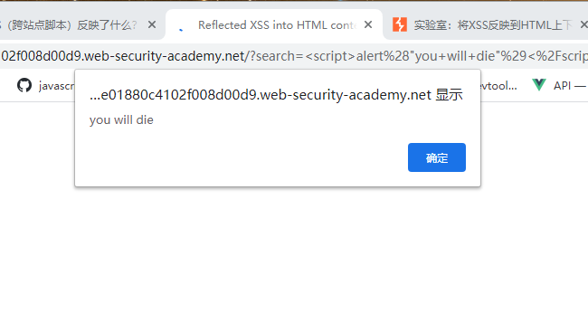

在计算机科学中, 图(graph) 是一种抽象数据类型, 旨在实现数学中的无向图和有向图概念，特别是图论领域。

一个图数据结构是一个(由有限个或者可变数量的)顶点/节点/点和边构成的有限集。

[原文出处](https://github.com/trekhleb/javascript-algorithms/blob/master/src/data-structures/graph/README.zh-CN.md)

## 图是什么？

**图是互连节点的集合**

举个例子，一个简单的图可能是这样：


节点（node）用红色标出，通过黑色的边（edge）连接。
图可用于表示：
* 社交网络
* 网页
* 生物网络
* …

可以在图上执行怎样的分析？
* 研究拓扑结构和连接性
* 群体检测
* 识别中心节点
* 预测缺失的节点
* 预测缺失的边
* …

#### 图的基本表示方法

[原文地址](https://baijiahao.baidu.com/s?id=1640465303505218215&wfr=spider&for=pc)

图 G=(V, E) 由下列要素构成：

* 一组节点（也称为 verticle）V=1,…,n
* 一组边 E (V×V)
* 边 (i,j) ∈ E 连接了节点 i 和 j
* i 和 j 被称为相邻节点（neighbor）
* 节点的度（degree）是指相邻节点的数量


* 如果一个图的所有节点都有 n-1 个相邻节点，则该图是完备的（complete）。也就是说所有节点都具备所有可能的连接方式。
* 从 i 到 j 的路径（path）是指从 i 到达 j 的边的序列。该路径的长度（length）等于所经过的边的数量。
* 图的直径（diameter）是指连接任意两个节点的所有最短路径中最长路径的长度。


举个例子，在这个案例中，可以计算出一些连接任意两个节点的最短路径。该图的直径为 3，因为没有任意两个节点之间的最短路径的长度超过 3。

* 测地路径（geodesic path）是指两个节点之间的最短路径。
* 如果所有节点都可通过某个路径连接到彼此，则它们构成一个连通分支（connected component）。如果一个图仅有一个连通分支，则该图是连通的（connected）。

举个例子，下面是一个有两个不同连通分支的图：


* 如果一个图的边是有顺序的配对，则该图是有向的（directed）。i 的入度（in-degree）是指向 i 的边的数量，出度（out-degree）是远离 i 的边的数量。


* 如果可以回到一个给定节点，则该图是有环的（cyclic）。相对地，如果至少有一个节点无法回到，则该图就是无环的（acyclic）。
* 图可以被加权（weighted），即在节点或关系上施加权重。
* 如果一个图的边数量相比于节点数量较小，则该图是稀疏的（sparse）。相对地，如果节点之间的边非常多，则该图是密集的（dense）。


依次为：无向图，有向图，有环，无环，加权，未加权，稀疏的，密集的

### 如何存储图？
存储图的方式有三种，取决于你想用它做什么：

* 存储为边列表：存储有边连接的每一对节点的 ID。

* 使用邻接矩阵，这通常是在内存中加载的方式：


* 使用邻接列表：
1: [2, 3, 4], 2: [1, 3], 3: [2, 4]...

如下无向图用邻接矩阵和邻接列表表示


显然，这个无向图有13个点。0可以通往1,2,5,6；6可以通往0,4;5可以通往0,3,4。即0的邻居点有1,2,5,6；6的邻居点有0,4。

邻接矩阵：


如果两个点相邻，则用1表示，否则用0。例如1是0的邻居点，所以0和1相交对应的格子为1。

从这个图可以看出，如果每个点不是与大量的其它点互为邻居，则会有很多0出现。如果点的数量庞大，矩阵将十分巨大，且有很多空间浪费（0占据的格子）。

邻接列表：


转换成数组则是：
`[[6,2,1,5],[0],[0],[5,4],[5,6,3],[3,4,0],[0,4],[8],[7],[11,10,12],[9],[9,12],[11,9]]`

数组中的下标index代表点的ID，即：
0: [6,2,1,5]
1: [0]
2: [0]
3: [5,4]
4: [5,6,3]
5: [3,4,0]
6: [0,4]
7: [8]
8: [7]
9: [11,10,12]
10: [9]
11: [9,12]
12: [11,9]

[原文出处](https://www.cnblogs.com/mcomco/p/10298021.html)

#### 无向图
边没有方向的图称为无向图。
无向图G=<V,E>,其中：
1. V是非空集合，称为顶点集。
2. E是V中元素构成的无序二元组的集合，称为边集。

#### 二分图

二分图又称作二部图，是图论中的一种特殊模型。 设G=(V,E)是一个无向图，如果顶点V可分割为两个互不相交的子集(A,B)，并且图中的每条边（i，j）所关联的两个顶点i和j分别属于这两个不同的顶点集(i in A,j in B)，则称图G为一个二分图。

> 简而言之，就是顶点集V可分割为两个互不相交的子集，并且图中每条边依附的两个顶点都分属于这两个互不相交的子集，两个子集内的顶点不相邻。

无向图G为二分图的充分必要条件是，G至少有两个顶点，且其所有回路的长度均为偶数。

[原文出处](https://baike.baidu.com/item/%E4%BA%8C%E5%88%86%E5%9B%BE/9089095?fr=aladdin)

判断二分图的常见方法是染色法： 开始对任意一未染色的顶点染色，之后判断其相邻的顶点中，若未染色则将其染上和相邻顶点不同的颜色， 若已经染色且颜色和相邻顶点的颜色相同则说明不是二分图，若颜色不同则继续判断，bfs和dfs可以搞定！

>深度优先搜索（depth-first search）  广度优先搜索（breadth-first search）


## 跨站脚本XSS
跨站点脚本Cross-site scripting(也称为XSS)是一个web安全漏洞，攻击者可以利用它来破坏用户与易受攻击的应用程序之间的交互。它允许攻击者规避相同的源策略，该策略旨在将不同的网站隔离。跨站点脚本漏洞通常允许攻击者冒充受害者用户，执行用户能够执行的任何操作以及访问用户的任何数据。如果受害者用户在应用程序中具有特权访问权限，则攻击者可能完全控制应用程序的所有功能和数据。
### XSS如何工作
跨站点脚本通过操纵易受攻击的网站来工作，以便它将恶意JavaScript返回给用户。当恶意代码在受害者的浏览器中执行时，攻击者可以完全破坏他们与应用程序的交互。


这张图中，攻击者利用有漏洞的网站，发送给用户一则伪装成消息的恶意脚本，用户点开消息就会跳转到恶意脚本，攻击者就能获取用户的敏感信息。

### XSS攻击有哪些类型
* 反射型XSS，其中恶意脚本来自当前HTTP请求。
* 存储型XSS，其中恶意脚本来自网站的数据库。
* 基于DOM的XSS，该漏洞存在于客户端代码，而不是服务端代码中。

### 反射型跨站点脚本
反射型XSS是最简单的跨站点脚本，当应用程序在HTTP请求中接收数据并将该数据以不安全的方式包含在即时响应中时，就会出现这种情况。

简单示例：
`https://insecure-website.com/status?message=All+is+well.`

`<p>Status: All is well.</p>`

该应用程序不执行数据的任何其他处理，因此攻击者可以轻松地构造如下攻击：

`https://insecure-website.com/status?message=<script>/*+Bad+stuff+here...+*/</script>`

`<p>Status: <script>/* Bad stuff here... */</script></p>`

如果用户访问由攻击者构造的URL，则攻击者的脚本将在该用户与应用程序的会话的上下文中在用户的浏览器中执行。此时，脚本可以执行用户可以访问的任何操作并检索任何数据。


另一个示例：
假设网站有搜索功能，该功能通过URL参数接收用户提供的搜索词：`https://insecure-website.com/search?term=gift`
该应用程序在对此URL的响应中回显提供的搜索词：`<p>You searched for: gift</p>`

假设应用程序不对数据进行任何其他处理，则攻击者可以进行如下攻击：
`https://insecure-website.com/status?message=<script>/*+Bad+stuff+here...+*/</script>`
该URL导致以下响应：

`<p>You searched for: <script>/* Bad stuff here... */</script></p>`

如果应用程序的另一个用户请求攻击者的URL，则攻击者提供的脚本将在受害用户的浏览器与应用程序会话的上下文中执行。




### 存储型跨站点脚本
当应用程序从不可信来源接收数据并将该数据以不安全的方式包含在其以后的HTTP响应中时，就会出现存储型XSS也称为持久XSS

有问题的数据可以通过HTTP请求提交给应用程序；例如，对博客帖子的评论，聊天室中的用户昵称或客户订单上的联系方式。在其他情况下，数据可能来自其他不受信任的来源；例如，显示通过SMTP接收的消息的Webmail应用程序，显示社交媒体帖子的营销应用程序或显示来自网络流量的数据包数据的网络监视应用程序。

假设一个网站允许用户提交有关博客文章的评论，这些评论将显示给其他用户。用户使用HTTP请求提交评论，如下所示：
```text
POST /post/comment HTTP/1.1
Host: vulnerable-website.com
Content-Length: 100

postId=3&comment=This+post+was+extremely+helpful.&name=Carlos+Montoya&email=carlos%40normal-user.net
```
提交此评论后，任何访问博客文章的用户都将在应用程序的响应中收到以下内容：

`<p>This post was extremely helpful.</p>`

假设应用程序不执行任何其他数据处理，则攻击者可以提交如下恶意评论：

`<script>/* Bad stuff here... */</script>`
在攻击者的请求内，此注释将被URL编码为：

`comment=%3Cscript%3E%2F*%2BBad%2Bstuff%2Bhere...%2B*%2F%3C%2Fscript%3E`

现在，访问博客文章的任何用户都将在应用程序的响应中收到以下内容：

`<p><script>/* Bad stuff here... */</script></p>`

然后，攻击者提供的脚本将在受害用户与应用程序会话的上下文中在受害用户的浏览器中执行。


### 在不同情况下的反射型XSS
反映的跨站点脚本有许多不同的种类。反射数据在应用程序响应中的位置决定了使用哪种有效负载类型，也可能影响漏洞的影响。

另外，如果应用程序在反映提交的数据之前对其进行了任何验证或其他处理，则通常会影响所需的XSS有效负载类型。


### 反射型XSS攻击的影响

如果攻击者可以控制在受害者浏览器中执行的脚本，那么他们通常可以完全破坏该用户。除其他外，攻击者可以：

* 在用户可以执行的应用程序中执行任何操作。
* 查看用户能够查看的任何信息。
* 修改用户能够修改的任何信息。
* 启动与其他应用程序用户的交互，包括恶意攻击，这些交互似乎源自最初的受害者用户。

攻击者可以通过多种方式诱使受害用户发出由他们控制的请求，以传递反射的XSS攻击。其中包括在攻击者控制的网站上放置链接，或在允许生成内容的其他网站上放置链接，或者通过在电子邮件，推文或其他消息中发送链接来放置链接。攻击可能直接针对已知用户，也可能是针对应用程序的任何用户的不加选择的攻击： 对于攻击的外部传递机制的需求意味着，反射的XSS的影响通常不如存储的XSS严重，存储的XSS可以在易受攻击的应用程序内部传递独立的攻击。


### 利用跨站点脚本漏洞
证明已发现跨站点脚本漏洞的传统方法是使用alert()功能创建弹出窗口，不是因为XSS与弹出窗口有关，只是证明可以在给定域上执行任意JavaScript的一种方式。也有人在使用`alert(document.domain)`这是一种使JavaScript明确在哪个域上执行的方法。

有时，可能会想更进一步，通过提供完整的利用来证明XSS漏洞是真正的威胁。将探讨三种最流行和最强大的利用XSS漏洞的方法。

### 利用跨站点脚本窃取cookie

窃取cookie是利用XSS的传统方法。大多数Web应用程序使用cookie进行会话处理。您可以利用跨站点脚本漏洞将受害者的cookie发送到您自己的域，然后手动将cookie注入浏览器并模拟受害者。

实际上，此方法有一些重大限制：

* 受害者可能未登录。
* 许多应用程序使用该HttpOnly标志从JavaScript隐藏其cookie 。
* 会话可能被锁定到其他因素，例如用户的IP地址。
* 在可以劫持会话之前，会话可能会超时。

### 利用跨站点脚本捕获密码

如今，许多用户都使用了密码管理器来自动填写密码。可以通过创建密码输入，读取自动填充的密码并将其发送到您自己的域来利用此优势。此技术避免了大多数与窃取Cookie有关的问题，甚至可以访问受害人重复使用相同密码的每个其他帐户。

此技术的主要缺点是，它仅适用于具有执行密码自动填充的密码管理器的用户。（当然，如果用户没有保存密码，仍然可以尝试通过现场网络钓鱼攻击来获取其密码）

### 利用跨站点脚本执行CSRF

某些网站允许登录用户更改其电子邮件地址，而无需重新输入密码。如果发现了XSS漏洞，则可以使其触发此功能，以将受害者的电子邮件地址更改为您控制的电子邮件地址，然后触发密码重置以访问该帐户。

这种类型的利用通常称为跨站点请求伪造（CSRF），这有点令人困惑，因为CSRF也可能作为独立漏洞发生。当CSRF作为独立漏洞出现时，可以使用反CSRF令牌等策略对其进行修补。但是，如果还存在XSS漏洞，则这些策略不能提供任何保护。